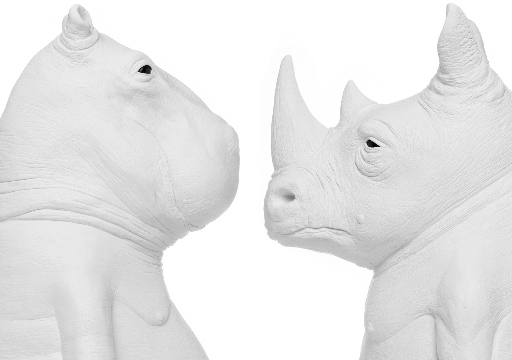

¡Hoy le toca el turno a Ornamante2!

Estas esculturas con forma animaloide buscan casa y para ello tenemos que realizar una web que nos permita hacérselas llegar al máximo número de personas, por lo tanto, tiene que ser responsive.

El equipo de diseño nos ha suministrado las visualizaciones en los distintos tamaños de pantalla:

> [Disenos](recursos/disenos.zip)

A nivel de diseño:

- Nos proporcionan todas las imágenes de todos los animalitos así como los logos

> [imgs.zip](recursos/imgs.zip)

- Los iconos de menú y shopping tendremos que sacarlos de https://www.svgrepo.com/ y crear una fuente iconográfica personalizada a través de https://icomoon.io/app

> [icon-fonts.zip](recursos/icon-fonts.zip)

- La fuente tipográfica es Montserrat, pudiendo encontrarla en https://fonts.google.com/. (utilizamos la tipo light y la regular)

> [fonts.zip](recursos/fonts.zip)
